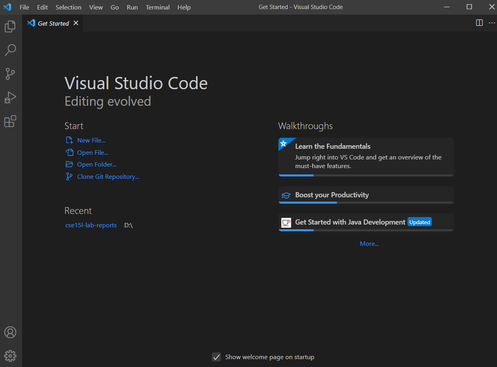
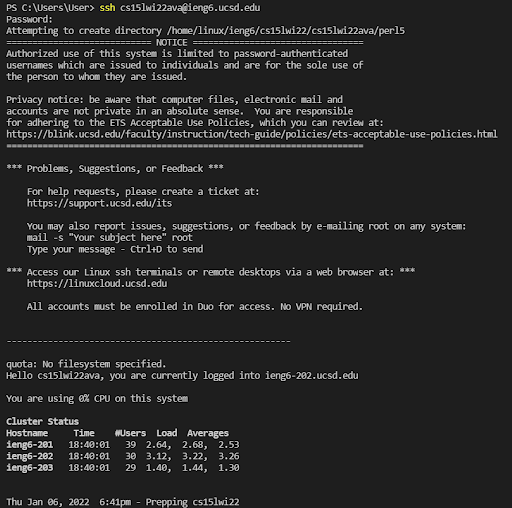
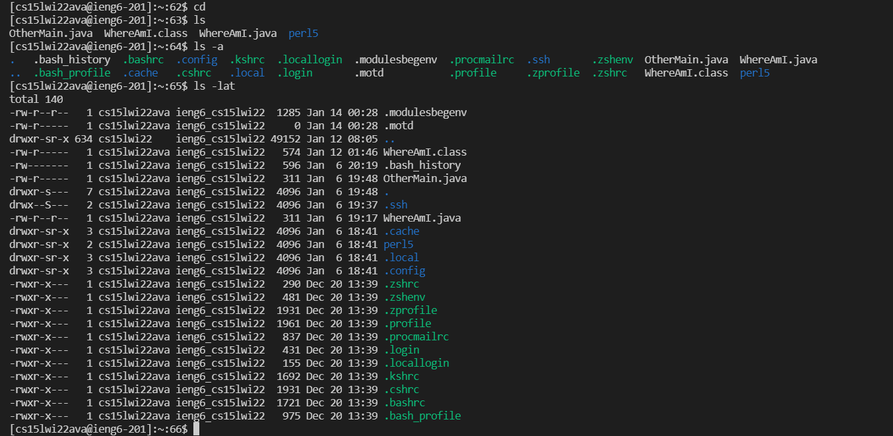
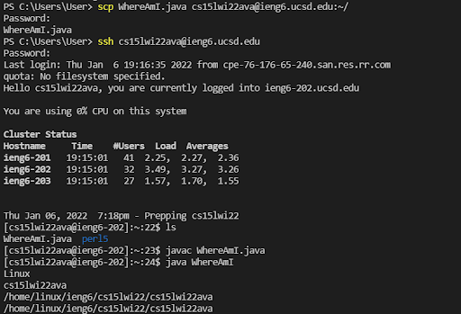
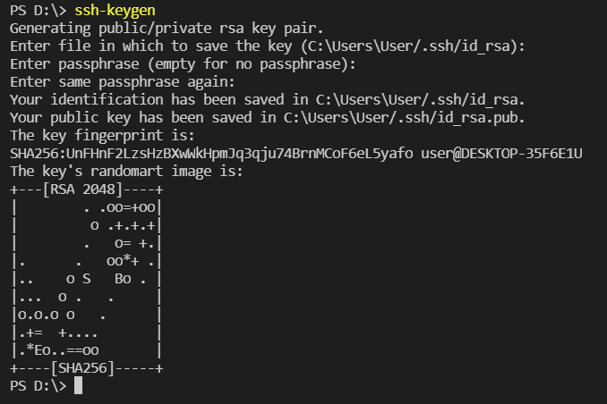
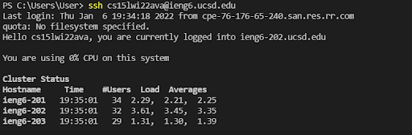
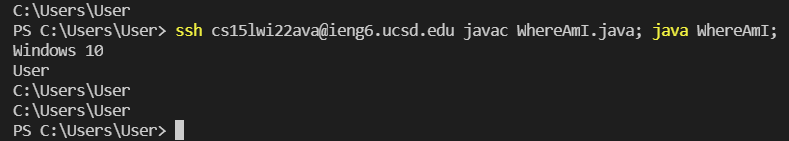

# Lab Report 1

**Installing VScode** 
> - Download VScode at [https://code.visualstudio.com](https://code.visualstudio.com)
> - Choose the right version for your Operating System
> - After you finish installing VScode, this is how it should look like when you open it:
> 

**Remotely Connecting** 
> - If you are on Windows, you will have to install OpenSSH with the following link:  
>[https://docs.microsoft.com/en-us/windows-server/administration/openssh/openssh_install_firstuse](https://docs.microsoft.com/en-us/windows-server/administration/openssh/openssh_install_firstuse)
> - Check your course-specific account:  
> [https://sdacs.ucsd.edu/~icc/index.php](https://sdacs.ucsd.edu/~icc/index.php)
> - Open a terminal in VScode
> - Type the following command 
> `ssh cs15lwi22ava@ieng6.ucsd.edu`  
> replace the "ava" by your own letters of your account
> - Enter the password
> - This is how it should look like if it is your first time 
> 

**Trying Some Commands** 
> - This is a list of useful commands that can be tried:  
>> `cd`  
>>> This command brings you back home  
> 
>> `ls`  
>>> This command shows the files in that directory  
>>>> `ls -a`  
>>> This command shows all the files (including hidden ones) in that directory  
>>
>>>> `ls -lat`  
>>> This command shows all files and hidden ones with detailed information
>
> Here is a screenshot of the example output of the commands 
> 
> You can log out by pressing Ctrl-D or typing the command `exit`

**Moving Files with scp** 
> - You can copy a file from your computer to the remote computer by typing the following command  
>> `scp < filename > < account >`
>
> - Here is an example of how it works:  
>>> - First create a file named WhereAmI.java with the following content: 
>>>>`class WhereAmI {
public static void main(String[] args) {
    System.out.println(System.getProperty("os.name"));
    System.out.println(System.getProperty("user.name"));
    System.out.println(System.getProperty("user.home"));
    System.out.println(System.getProperty("user.dir"));
  }
}` 
>>>
>>>- Then run `javac` and `java` on your computer with the file  
>>>- After that run the command (replace the account name with yours)
>>>> `scp WhereAmI.java cs15lwi22ava@ieng6.ucsd.edu:~/` 
>>>
>>>- Login with `ssh` then type `ls`, then your file will show up 
>>>

**Setting an SSH Key** 
> - This is used to eliminate the time of typing your password again and again when you try to login
> - Type the following command on your computer:
>>`ssh-keygen`
> - This is how it will show up:  
>
>- If you are using Windows, you might need the extra ssh-add steps with more information here:
[https://docs.microsoft.com/en-us/windows-server/administration/openssh/openssh_keymanagement#user-key-generation](https://docs.microsoft.com/en-us/windows-server/administration/openssh/openssh_keymanagement#user-key-generation)
> - After typing the command, it will create two files, one public key and one private key
> - Then you copy the private key to the .ssh directory of the remote computer with the command (Change your own values in the brackets):
>> `scp < C:\Users\User/.ssh/id_rsa.pub. > < cs15lwi22ava@ieng6.ucsd.edu:~/.ssh/authorized_keys >`
>
> - Now you don't need a password to login everytime 
>

**Optimizing Remote Running** 
> - You can directly run command on the remote server with quotes after the ssh command
>> `ssh cs15lwi22ava@ieng6.ucsd.edu "ls -lat"`
>
> - To run multiple commands in the same line, you can use semicolons 
>> `ssh cs15lwi22ava@ieng6.ucsd.edu javac WhereAmI.java; java WhereAmI;`
>
>> Using this optimized version the number of keystrokes is 2, without the optimzation the number of keystrokes is 6 which shows that the optimized version is more effective and save more time

>- Here is a screenshot of the example: 
>
