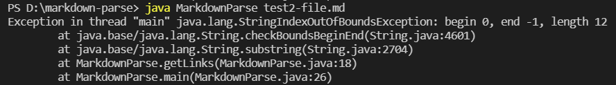

# Lab Report 2

**1st Bug Fix**
> Code change difference:
> 
>
> Link to the test file: [Test file](https://github.com/hanghanghappy/markdown-parse/blob/main/test2-file.md)
>
> Symptom of the failure-inducing input: 
>
> 
> 
>The cause of this bug is when the file does not have parentheses so `openParen` and `closeParen` will be `-1`. The symptom is that it leads to a `StringIndexOutOfBoundsException`. To fix this, there needs to be a check for parentheses and it will return an empty list if no parentheses is found.

**2nd Bug Fix**
> Code change difference:
> 
>
> Link to the test file: [Test file](https://github.com/hanghanghappy/markdown-parse/blob/main/test3-file.md)
>
> Symptom of the failure-inducing input: 
>
> 
> 
> The cause of this bug is when the file only has parentheses but not brackets. It still adds the text regardless because there is parentheses. (With the bug fix above)The symptom is that it still gives an output of list with `stuff` in it which is not intended. To fix this, there needs to be a check for brackets as well and it will return an empty list if there is not either parentheses or brackets.

**3rd Bug Fix**
> Code change difference:
> 
>
> Link to the test file: [Test file](https://github.com/hanghanghappy/CSE15L-Platypus/blob/main/test-file6.md)
>
> Symptom of the failure-inducing input: 
>
> 
>
> The cause of this bug is when there is a `!` in the line because with `!` before the brackets means that it is an image not a link, however, the code does not recognize it. The symptom is that the list contains the two texts while there should be only one which is `page1.com` as that is the only link. To fix this, there needs to be a check for the character before the open bracket if it is an exclamation mark or not and if it is, then the content of that line will not be added to the list.
