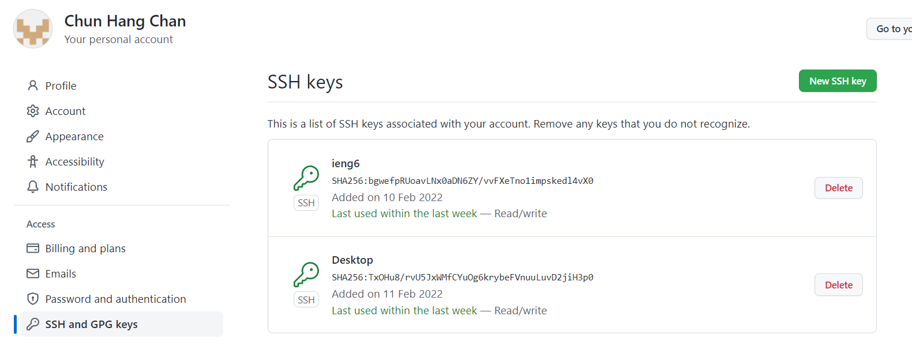
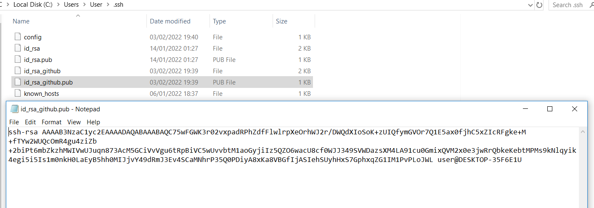
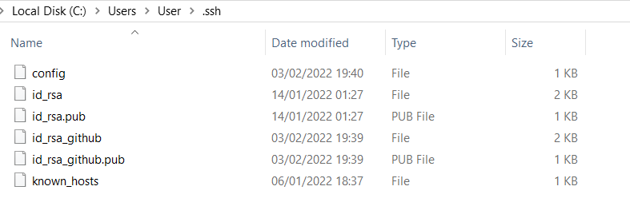

# Lab Report 3

**The public key I made is stored on Github and my user account**
> 
> 

**The private key I made is stored on my user account**
> 

**Git commands in my ieng6 account (commit and push a change)**
> 

**Link for the resulting commit**
>[Resulting Commit](https://github.com/hanghanghappy/markdown-parse/commit/b5bb63c31f9482291a3ce9f187c3415214b5c03a)