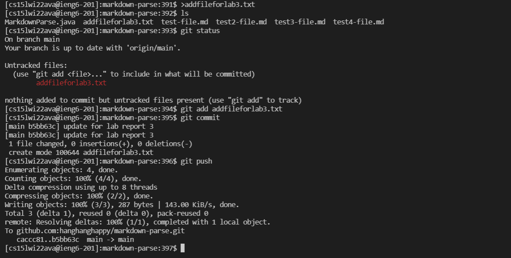

# Lab Report 3

**The public key I made is stored on Github and my user account**
> I have made a key for Github use and I uploaded it to Github as well. Here are the screenshots for where the public key is on my user account and Github.
>
> 
>
> 

**The private key I made is stored on my user account**
> This is where the private key is stored on my user account.
>
> 

**Git commands in my ieng6 account (commit and push a change)**
> I created a file in the directory and commit then push the change to Github.
>
> 

**Link for the resulting commit**
> Here is the link to the commit that I have made from the step above.
>
> [Resulting Commit](https://github.com/hanghanghappy/markdown-parse/commit/b5bb63c31f9482291a3ce9f187c3415214b5c03a)