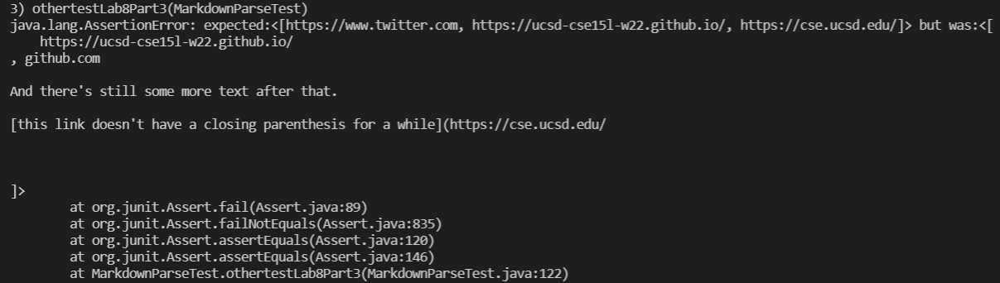

# Lab Report 4

[Link to my markdown-parse repository](https://github.com/hanghanghappy/CSE15L-Platypus)

[Link to the markdown-parse repository I reviewed](https://github.com/ezhou413/markdown-parse)


**I decide what the snippets should produce by VScode preview**

## **Snippet 1**

**What it should produce:**

```[`google.com, google.com, ucsd.edu]```

**How I turned it into a test for my implementation:**


**My implementation:**


It didn't pass the test.

**How I turned it into a test for the implementation that I reviewed:**


**For the implementation that I reviewed:**


It didn't pass the test.

## **Snippet 2**

**What it should produce:**

```[a.com, a.com(()), example.com]```

**How I turned it into a test for my implementation:**


**My implementation:**


It didn't pass the test.

**How I turned it into a test for the implementation that I reviewed:**


**For the implementation that I reviewed:**


It didn't pass the test.

## **Snippet 3**

**What it should produce:**

```[https://www.twitter.com, https://ucsd-cse15l-w22.github.io/, https://cse.ucsd.edu/]```

**How I turned it into a test for my implementation:**


**My implementation:**


It didn't pass the test.

**How I turned it into a test for the implementation that I reviewed:**


**For the implementation that I reviewed:**



It didn't pass the test.

## **Questions and Answers**

**Q1:** Do you think there is a small (<10 lines) code change that will make your program work for snippet 1 and all related cases that use inline code with backticks? If yes, describe the code change. If not, describe why it would be a more involved change.

**A:** I think that a small code change is possible to make my program work for snippet 1 and all related cases. As for my output there is `` `google.com`` and `google.com` an extra `url.com` but not `ucsd.edu` instead. The code change will be checking the backticks in the file as well that they have be within the brackets to be considered as links.

**Q2:** Do you think there is a small (<10 lines) code change that will make your program work for snippet 2 and all related cases that nest parentheses, brackets, and escaped brackets? If yes, describe the code change. If not, describe why it would be a more involved change.

**A:** I think that it would be a more involved change to make my program work for snippet 2 and all related cases. It is because my program will first have to check the total number of brackets and parentheses in the string in order to know if they are valid or not by checking if there are proper open and close brackets or parentheses as pairs. Also, for the escaped brackets part, the `\` and the character following it will have to be considered as escaped characters just like `!` for the images.

**Q3:**  Do you think there is a small (<10 lines) code change that will make your program work for snippet 3 and all related cases that have newlines in brackets and parentheses? If yes, describe the code change. If not, describe why it would be a more involved change.

**A:** I think that it would be a more involved change to make my program work for snippet 2 and all related cases. It is because my program will have to check newlines between the opening brackets and closing brackets and also between the opening parenthesis and closing parenthesis. It also needs to implement the change for checking the pairs of brackets and parentheses same as above to make sure it is valid.