# Lab Report 5
## Find tests with different results
First, I run the command ```bash script.sh > results.txt``` in the directories ```CSE15L-Platypus``` which is the implementation from my group and ```week9``` which is the implementation provided. This stores the results into different ```results.txt``` files in those two directories. After that, I run the command ```diff CSE15L-Platypus/results.txt week9/results.txt``` to see the difference between the two results. This is what it shows after typing the command:

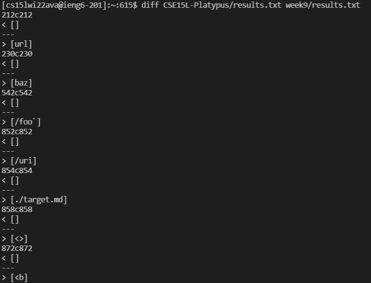

As an example, we can see the text ```230c230``` which ```230``` represents the line number. We can then check the line number of the ```results.txt``` to confirm which test it is. While the content beside ```<``` stands for the one in ```CSE15L-Platypus/results.txt``` directory and the content beside ```>``` stands for the one in ```week9/results.txt``` in this case with the command above.

## Test 1 : 511.md
Here is the difference between my group implementation and the one provided:

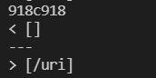

The line number that shows results of ```511.md``` is ```918``` in ```results.txt```

(The following pictures show as an example of how to find the corresponding test according to the line number)

(The picture is from ```CSE15L-Platypus/results.txt```)

 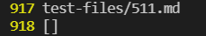

(The picture is from ```week9/results.txt```)

 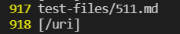

 The content of ```511.md```:

 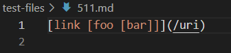

 The results of my group implementation which is ```[]``` while the implementation provided which is ```[/uri]``` are different. The expected output is ```[/uri]``` which shows that the implementation provided in Lab 9 is the correct one.

The problem in my implementation is that it does not check for the proper open and close brackets that it considers the markdown text as invalid. To fix it, my code has to first find the total number of brackets and then check if it is a proper pair. It has to check if the first opening bracket has a corresponding closing bracket. If it is valid, then double check the same thing for parentheses as well to see if it is a proper link. As shown in my code below, it finds the first opening bracket and then it finds the next closing bracket directly which is not the last closing bracket in the case of ```511.md```, this therefore causes the problem.

Here is the part of my code for the fix described above:

 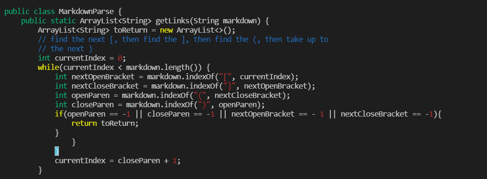


## Test 2 : 516.md
Here is the difference between my group implementation and the one provided:

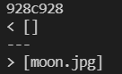

The line number that shows results of ```516.md``` is ```928``` in ```results.txt```

(The following pictures show as an example of how to find the corresponding test according to the line number)

(The picture is from ```CSE15L-Platypus/results.txt```)

 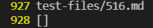

(The picture is from ```week9/results.txt```)

 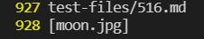

  The content of ```516.md```:

 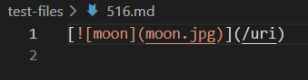

  The results of my group implementation which is ```[]``` while the implementation provided which is ```[moon.jpg]``` are different. The expected output is ```[/uri]``` which shows that both implementations are incorrect.
  
  The problem in the implementation provided is that it considers ```moon.jpg``` as a link. While the output should be ```[/uri]``` which is the link instead. The problem is that the code does not recognize the ```!``` symbol and therefore expect the ```moon.jpg``` as a link instead of an image because having proper bracket and parentheses pairs. It needs to have the ability to detect images by checking for symbols like ```!``` as in this case the picture will be the display for people to click to access the link. As shown in the code below, there is no check for symbols such as ```!``` and that's why ```moon.jpg``` is recognized as a link. A fix will be checking if the text contains any special symbols like ```!```.

  Here is the part of the code from Lab9 for the fix described above:
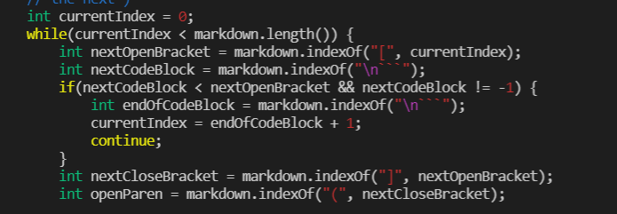
